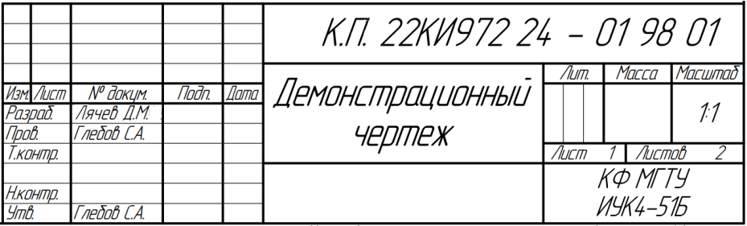
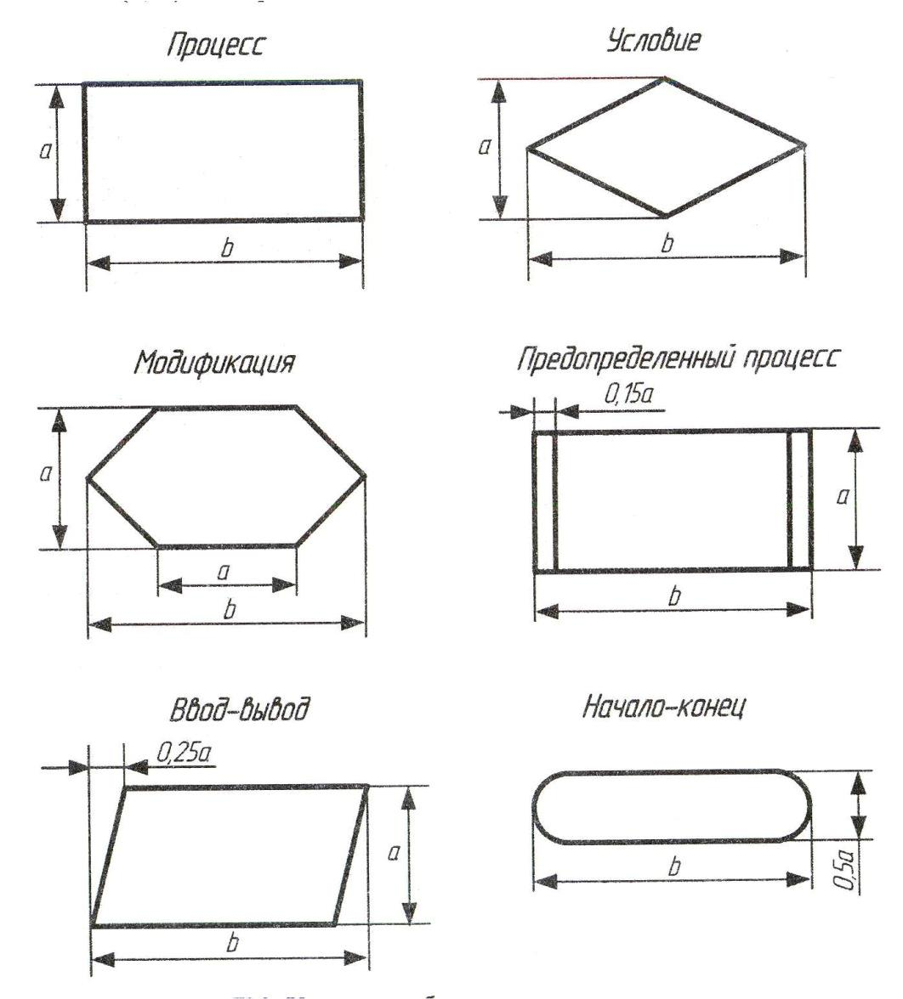
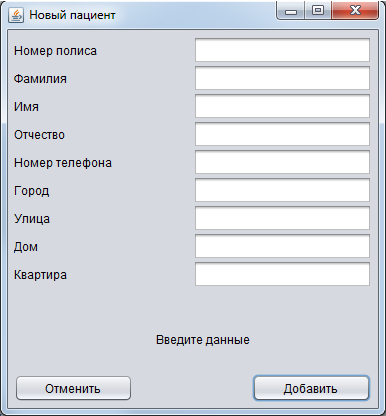
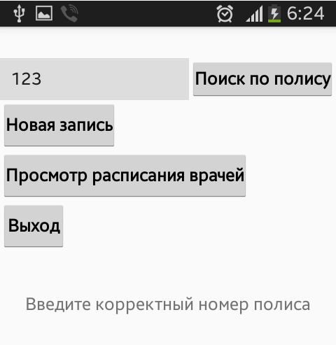
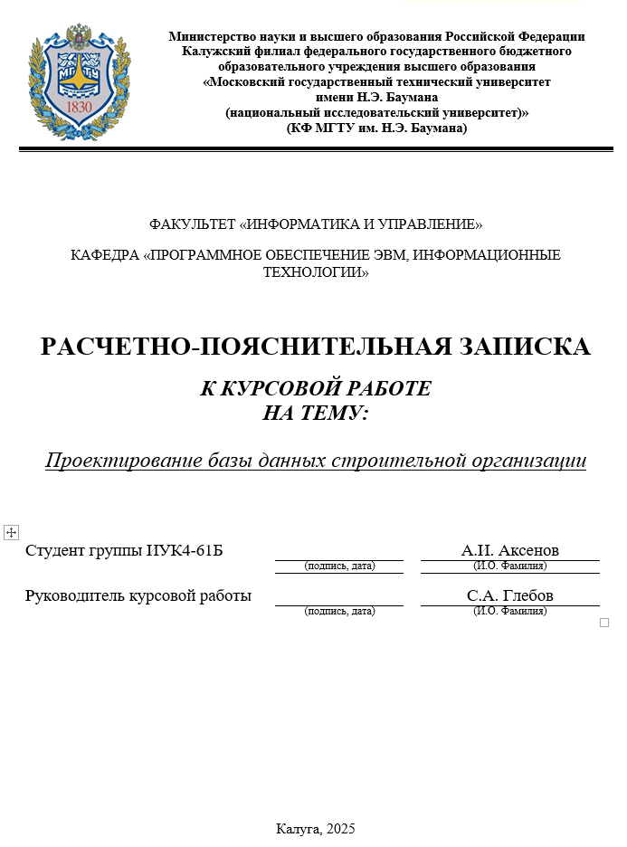
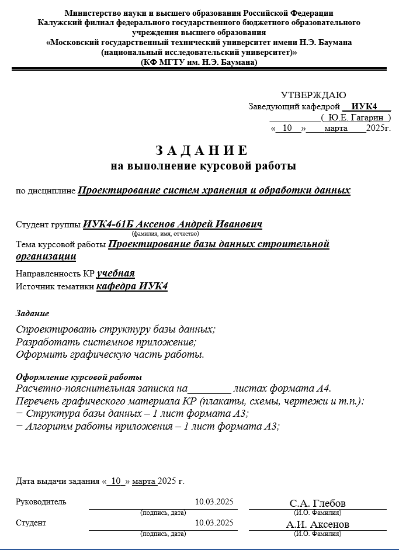
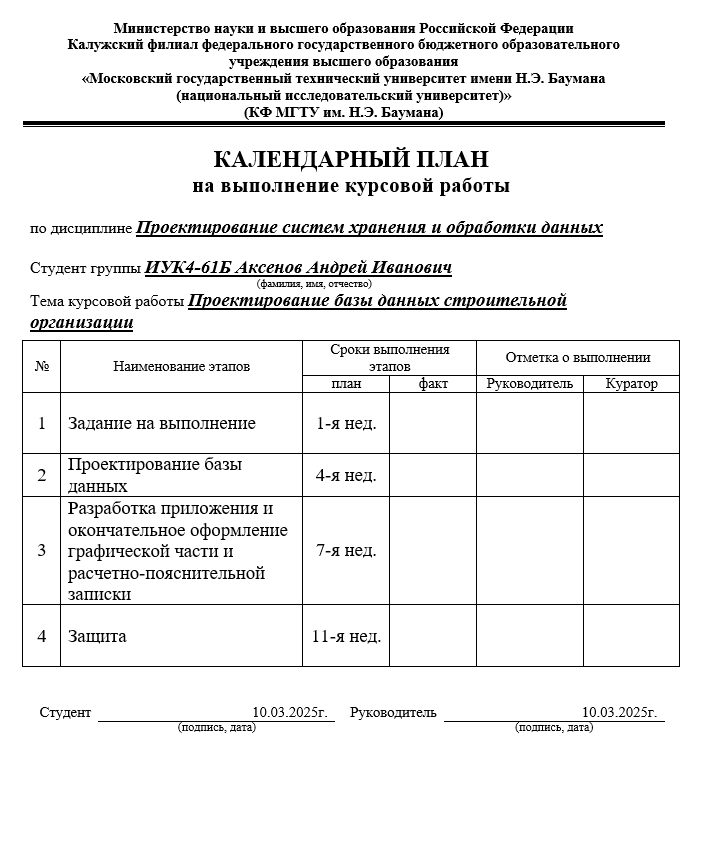

Министерство науки и высшего образования Российской Федерации Калужский
филиал

> федерального государственного бюджетного образовательного учреждения
> высшего образования
>
> «**Московский** **государственный** **технический** **университет**
> **имени** **Н.Э.** **Баумана**
>
> **(национальный** **исследовательский** **университет)**» (КФ МГТУ им.
> Н.Э. Баумана)
>
> Е.В.Красавин, Ю.Е.Гагарин, С.А. Глебов
>
> **Курсовое** **проектирование** **по** **дисциплине**
> **«Проектирование** **систем** **хранения**
>
> **и** **обработки** **данных»:** **учебное** **пособие**
>
> Калуга, 2025
>
> УДК 004.62 ББК 32.972.1
>
> К435
>
> Доцент кафедры «Системыобработкиинформации»КФМГТУ им. Н.Э.Баумана
> канд. техн.наук, доц. В.О.Трешневская
>
> Начальникотдела «Численного анализапассивной безопасности» Центра
> «ЧАиВВ» ФГУП «НАМИ», канд. техн.наук Д.Ю.Солопов
>
> Утверждено Методической комиссиейКФМГТУ им.Н.Э.Баумана (рег. номер
> <u>014/МК2025-01)</u>

КрасавинЕ.В., ГагаринЮ.Е., ГлебовС.А

> Курсовое проектирование по дисциплине «Проектирование систем хранения
> и обра-ботки данных»: учебное пособие/ Е.В.Красавин, Ю.Е.Гагарин,
> С.А.Глебов – Калуга: КФМГТУ им. Н.Э.Баумана, 2025. -23 с.
>
> В учебном пособии приведены теоретические сведения и характеристика
> исходных данных для выполнения курсовой работы, рекомендации по
> выполнению, формы отчетности о выполненной работе, требования к
> оформлению, рекомендуемые источники информации.
>
> Учебное пособие предназначено для студентов КФ МГТУ им. Н.Э.Баумана,
> обучающихся по направлению подготовки 09.03.04 «Программная
> инженерия».
>
> © Калужский филиал МГТУ им. Н.Э. Баумана, 2025 г. © Е.В.Красавин, 2025
> г.
>
> © Ю.Е.Гагарин, 2025 г © С.А. Глебов, 2025 г
>
> 2
>
> **ОГЛАВЛЕНИЕ**

ВВЕДЕНИЕ (ЦЕЛИ И
ЗАДАЧИ)..............................................................4

ТЕОРЕТИЧЕСКИЕ СВЕДЕНИЯ И ХАРАКТЕРИСТИКА ИСХОДНЫХ ДАННЫХ (ПОЛНАЯ ИЛИ
ПРИМЕРНАЯ ТЕМАТИКА
РАБОТ)........................................................................................................6

РЕКОМЕНДАЦИИ ПО ВЫПОЛНЕНИЮ РАБОТ (ПРОЕКТОВ).........9

ФОРМА ОТЧЕТНОСТИ О ВЫПОЛНЕННЫХ РАБОТАХ (ПРОЕКТАХ), ТРЕБОВАНИЯ К
ОФОРМЛЕНИЮ..............................10

КОНТРОЛЬНЫЕ ВОПРОСЫ И
ЗАДАНИЯ:.........................................15 РЕКОМЕНДУЕМЫЕ
ИСТОЧНИКИ ИНФОРМАЦИИ........................16 ПРИЛОЖЕНИЕ А
....................................................................................17
ПРИЛОЖЕНИЕ
Б.....................................................................................18
ПРИЛОЖЕНИЕ
В.....................................................................................19
ПРИЛОЖЕНИЕ
Г.....................................................................................22

> 3
>
> **ВВЕДЕНИЕ** **(ЦЕЛИ** **И** **ЗАДАЧИ)**

Курсовое проектирование является важнейшим компонентом самостоятельной и
контактной работы обучающихся по основным об-разовательным программам
Университета. Курсовое проектирование – это наиболее эффективная форма
практико-ориентированного обу-чения, способствующая освоению
обучающимися образовательной программы и формированию у них комплекса
компетенций за счет выполнения практических задач, близких к будущей
профессиональ-ной деятельности обучающегося.

Целью курсового проектирования является приобретение обуча-ющимися опыта
комплексного решения практических задач, развитие умений и навыков,
необходимых для профессиональной деятельности выпускника.

> Основными задачами курсовой работы являются:

\- практическое освоение дисциплины «Кроссплатформенная разработка
программного обеспечения»;

\- развитие навыков поиска и систематизации информации по теме курсовой
работы;

\- развитие навыков работы со справочной, методической и науч-ной
литературой;

> \- развитие навыков проектирования;

\- овладение навыками исследования или проработки вариантов технических
решений, анализа полученных решений и обоснование выбора варианта
технического решения для разрабатываемого объ-екта;

\- развитие навыков применения современных компьютерных систем
аналитического расчета при исследовании вариантов возмож-ных решений,
оптимизации выбранного варианта технического реше-ния,
автоматизированного проектирования и моделирования процес-сов
функционирования технических объектов, а также физических,
информационно-коммуникационных, организационно-управленче-ских,
технико-экономических и других научно-технических процес-сов;

\- развитие навыков оформления текстовой и графической ин-формации в
соответствии с нормативными документами;

\- развитие навыков критического анализа, полученных в ходе
проектирования результатов, формулировки выводов, предложений и
рекомендаций по результатам выполненной работы;

> 4

\- развитие навыков оформления и публичной защиты получен-ных
результатов, в том числе с помощью презентаций.

Курсовое проектирование способствует развитию в обучаю-щихся:

> \- системного мышления;
>
> \- интеллектуального творческого потенциала;

\- навыков организации самостоятельной деятельности и оценки ее
эффективности;

> \- профессиональной письменной и устной речи.
>
> Выполнение курсовой работы должно:

\- базироваться на материале, изложенном в лекциях или иных источниках
информации, приведенных как в базовой учебной дисци-плине, так и смежных
с ней;

\- вырабатывать у обучающегося способность самостоятельного поиска,
анализа и обработки информации;

\- завершаться оформлением результатов выполнения курсовой работы в
соответствии с рекомендуемыми нормативными докумен-тами – ГОСТами, ЕСКД,
ЕСТД, ЕСПД.

\- сопровождаться организационными и учебно-методическими мероприятиями,
способствующими выполнению в установленные сроки как курсовой работы в
целом, так и его этапов.

> 5
>
> **ТЕОРЕТИЧЕСКИЕ** **СВЕДЕНИЯ**
>
> **И** **ХАРАКТЕРИСТИКА** **ИСХОДНЫХ** **ДАННЫХ** **(ПОЛНАЯ** **ИЛИ**
> **ПРИМЕРНАЯ** **ТЕМАТИКА** **РАБОТ)**

Курсовое проектирование проводится в определенные учебным планом сроки,
которые включают в себя выдачу задания, выполнение этапов проекта в
процентах и публичную защиту с проставлением балльнорейтинговой оценки,
учитывающей уровень защиты и каче-ство выполнения этапов.

Иные сроки курсового проектирования могут быть индивиду-ально
установлены обучающемуся распоряжением декана факуль-тета/приказом
ректора. Копия индивидуального графика направляется на соответствующую
кафедру, далее заведующий кафедрой устанав-ливает для данного
обучающегося индивидуальный график консульта-ций, сроков выполнения
этапов и защиты курсовой работы.

Задание на выполнение курсовой работы выдается обучающе-муся
руководителем проекта с его подписью и с указанием даты вы-дачи задания,
оформляется в двух экземплярах: один выдается обуча-ющемуся, второй
хранится на кафедре.

В задании на курсовую работу формулируется тема, даются ис-ходные данные
для выполнения отдельных частей курсовой работы, характеристики,
определяющие объем и содержание частей проекта.

Для формирования у обучающихся умения работать в команде возможна выдача
заданий, предусматривающих одновременную ра-боту нескольких обучающихся
по одной теме курсовой работы. При этом каждому обучающемуся должен быть
оговорен перечень индиви-дуальных задач, соблюдая равенство трудоемкости
работ и единые требования к полученным результатам.

Обучающемуся предоставляется возможность в течение не-скольких семестров
последовательно выполнять задания по несколь-ким дисциплинам на тему,
связанную с предполагаемым заданием на выпускную квалификационную
работу. При этом на каждом курсовом проектировании обучающийся
прорабатывает те части выпускной ква-лификационной работы, которые
опираются на соответствующие дис-циплины.

Структура и содержание курсовой работы определяются рабо-чей программой
дисциплины (РПД), по которой выполняется проект, и формируемыми
компетенциями в процессе курсового проектирова-ния.

> 6

Курсовая работа включает в себя графическую часть (чертежи, схемы) или
иллюстративный материал и расчетно-пояснительную за-писку, может в себя
включать аналитическую, конструкторскую, тех-нологическую,
исследовательскую и другие части, выполненные в со-ответствии с
требованиями, установленными РПД, стандартами и дру-гими нормативными
документами.

Оформление основных элементов схем алгоритмов показано в <u>Приложении
Б.</u>

Курсовая работа содержит разделы, раскрывающие в полном объеме этапы
выполнения задания и отражающие вид проводимых ис-следований (работ) –
учебного, фундаментального, поискового или прикладного характера. Может
включать в себя графическую часть или другой иллюстративный материал.

Руководитель осуществляет руководство и контроль выполне-ния курсовой
работы. В период выполнения курсовой работы руково-дитель обязан
выполнять следующие функции:

> \- выдать обучающемуся задание на курсовую работу;

\- оказывать помощь в составлении плана работы над курсовым проектом;

\- рекомендовать справочную и научную литературу и другие ис-точники
информации по теме курсовой работы;

\- проводить индивидуальные консультации не менее одного раза в неделю;

\- осуществлять контроль выполнения курсовой работы с внесе-нием
информации в подсистему «Электронный университет»;

\- регулярно передавать информацию о выполнении курсовой ра-боты
куратору учебной группы.

Установленным сроком завершения курсовой работы является срок за две-три
недели до окончания теоретических занятий текущего семестра. После этого
назначаются даты проведения защиты курсовой работы, утвержденные
заведующим кафедрой.

Ход выполнения работ обучающимся контролирует руководи-тель курсовой
работы и вносит текущие значения процента выполне-ния работы на данном
этапе по каждому обучающемуся в «Электрон-ный университет» (ЭУ).

> Если руководитель считает, что курсовая работа: - не соответствует
> заданию,
>
> \- не удовлетворяет предъявляемым требованиям,
>
> \- задачи проектирования решены неудовлетворительно, - имеются ошибки
> в расчетах,
>
> 7

\- по неуважительной причине нарушены сроки выполнения эта-пов курсовой
работы, то Руководитель имеет право не подписывать материалы проекта и
письменно обосновывает свое решение на ти-тульном листе пояснительной
записки. Вместе с тем, руководитель оценивает проделанную обучающимся
работу к моменту завершения консультаций за уровень самостоятельности и
за соответствие выпол-ненной работы заданию.

Обучающийся имеет право представить подготовленные им ма-териалы за
своей подписью непосредственно комиссии в соответствии с графиком защит.

Комиссия, рассмотрев представленную обучающимся к защите курсовую
работу, с учетом мнения руководителя, может провести за-щиту с
выставлением балльно-рейтинговой оценки.

Итоговые результаты за курсовую работу в соответствии с сум-мой
набранных баллов выставляются в виде оценок «удовлетвори-тельно»,
«хорошо», «отлично», «неудовлетворительно», или, признав курсовую работу
недоработанным, – оценку «не аттестован».

При заполнении подсистемы «Электронный университет» и от-четов о смотре
курсовых проектов, необходимо учитывать следующее распределение
нормативной нагрузки и сроки выполнения курсовых проектов : - получение
обучающимся задания, обсуждение его с руко-водителем и составление плана
работ – 10%, не позднее 4 учебной не-дели;

\- первая часть курсовой работы, в которую входят теоретиче-ские
расчеты, обоснования конструктивных решений и т.д. – 30%, не позднее 7
учебной недели;

\- вторая часть курсовой работы, в которую входит графическая часть или
иллюстративные материалы – 40%, не позднее 10 учебной недели;

\- выполнение расчетно-пояснительной записки и оформление курсовой
работы – 20%, не позднее 14 недели;

> \- защита курсовой работы, не позднее 14 недели.

***Типовые*** ***задания*** ***для*** ***курсовой*** ***работы***

Разработать информационную систему для автоматизации работы учебного
отдела вуза

> Разработать информационную систему для отдела кадров Разработать
> информационную систему финансовой организации
>
> 8
>
> **РЕКОМЕНДАЦИИ** **ПО** **ВЫПОЛНЕНИЮ** **РАБОТ** **(ПРОЕКТОВ)**

Выполнение курсовой работы требует тщательного планирова-ния и
выполнения определённых шагов. Вот несколько рекомендаций, которые могут
помочь вам в этом процессе:

1\. Определите цель и аудиторию приложения. Прежде чем начать
разработку, важно понять, для чего нужно приложение и кто будет его
использовать. Это поможет определить требования к функ-циональности и
дизайну.

2\. Выберите технологию. Решите, какие технологии вы будете использовать
для создания приложения. Это может быть язык про-граммирования,
фреймворк, база данных и т.д. Учитывайте свои навыки и опыт, а также
требования проекта.

3\. Создайте структуру базы данных. Определите, какие данные будут
храниться в базе данных, и создайте схему. Используйте норма-лизацию для
оптимизации структуры и предотвращения дублирования данных.

4\. Используйте ORM (Object-Relational Mapping). ORM позво-ляет работать
с базой данных через объекты, что упрощает код и де-лает его более
читаемым. Выберите подходящую библиотеку ORM для вашего языка
программирования.

5\. Обеспечьте безопасность. Защитите базу данных от
несанкци-онированного доступа и атак. Используйте шифрование паролей,
аутентификацию пользователей, контроль доступа и другие меры
без-опасности.

6\. Оптимизируйте запросы. Пишите эффективные запросы к базе данных,
чтобы избежать медленной работы приложения. Исполь-зуйте индексы,
оптимизированные запросы и кэширование.

7\. Тестируйте приложение. Проведите тестирование приложе-ния на разных
устройствах и браузерах, чтобы убедиться в его работо-способности и
совместимости.

> 9
>
> **ФОРМА** **ОТЧЕТНОСТИ** **О** **ВЫПОЛНЕННЫХ** **РАБОТАХ**
> **(ПРОЕКТАХ),** **ТРЕБОВАНИЯ** **К** **ОФОРМЛЕНИЮ**

По завершении курсовой работы обучающийся оформляет гра-фические
материалы по ЕСКД (ЕСТД, ЕСПД и т.п.) ГОСТ 2.103-2013, 3.1001-2011 и
т.п. и расчетно-пояснительную записку в соответствии с требованиями ГОСТ
2.105-2019, ГОСТ 2.106-2019, ГОСТ 7.32-2017 – для текстовой
конструкторской документации, ГОСТ 3.1105-2011 – для текстовой
технологической документации, ГОСТ 19.105-78 – для текстовой программной
документации.

По завершении курсовой работы расчетно-пояснительная за-писка
оформляется по ГОСТ 7.32-2017.

Все материалы, подготовленные в ходе курсового проектирова-ния,
выполняются на компьютере. Расчетно-пояснительная записка печатается на
одной стороне белой бумаги формата А4.

Отчет по выполненному курсовому проекту должен содержать
расчетно-пояснительную записку и графическую часть.

Расчетно-пояснительная записка состоит из следующих струк-турных
элементов:

> **Титульный** **лист.** (<u>Приложение Г)</u>
>
> **Задание** **на** **курсовую** **работу.** (<u>Приложение Г</u>)
> **Календарный** **план.** (<u>Приложение Г)</u>

**Введение**. Актуальность темы курсовой работы, объект и пред-мет
исследования, цель и задачи курсовой работы (1..2 стр.).

1\. **Методы** **и** **инструменты** **программной** **инженерии.**
Техни-ческое задание, анализ предметной области, анализ аналогов,
обосно-вание выбора инструментов разработки, обоснование выбора СУБД,
выводы (10..15 стр.).

2\. **Проектирование** **компонентов** **программного** **продукта.**
Проектирование функциональной модели, проектирование приложе-ния,
проектирование базы данных, основные алгоритмы, выводы (10-15 стр.).

3\. **Тестирование** **и** **интеграция** **компонентов**
**программного** **изделия.** Разработка тестов и результаты
тестирования, описание ин-терфейс приложений, руководство пользователей,
руководство адми-нистратора, выводы (10-15 стр.).

**Заключение**. Степень решения поставленных задач, перспек-тивы
развития проекта (1-2 стр.).

> **Список** **используемой** **литературы** **Приложения** (при
> необходимости)
>
> 10

Графическая часть выполняется в соответствии требованиями ЕСКД на листах
формата А1 (минимально 2 листа). При печати реко-мендуется
маштабирование до формата А3.

В графической части размещаются чертежи, графики, схемы, диаграммы и
прочий иллюстративный материал, необходимый обуча-ющемуся для защиты
курсовой работы.

Наиболее типичные материалы, выносимые в графическую часть: схема базы
данных, диаграмма классов, функциональная диа-грамма, диаграмма
вариантов использования, блок-схемы алгоритмов, демонстрационные
иллюстрации работы приложения.

***Организация*** ***защиты*** ***курсовой*** ***работы***

Защита является промежуточной аттестацией по самостоятель-ной части
дисциплины и обязательной формой проверки качества вы-полнения курсовой
работы.

Защиту проекта принимает комиссия, назначенная распоряже-нием
заведующего кафедрой. В распоряжении приводится состав ко-миссии, дата,
время и помещение, в котором будет производиться за-щита.

График работы комиссий по приему курсовых проектов состав-ляется с
учетом занятости обучающихся по другим дисциплинам. Ко-миссия может
проводить процедуру защиты, только при наличии не менее двух членов из
числа уполномоченных на это заведующим ка-федрой.

На защиту представляются материалы, оформленные согласно требований и
подписанные обучающимся и руководителем курсовой работы.

Могут быть представлены также образцы созданной в ходе про-ектирования
продукции (изделия, оборудование, макеты, программы для ЭВМ и т.п.).

Защита состоит из доклада, продолжительностью 5-7 минут, и ответов на
вопросы членов комиссии. Обучающийся должен логично выстроить сообщение
о выполненной работе, обосновать принятые решения, продемонстрировать
понимание теоретических положений, на основе которых выполнен проект
(работа), показать самостоятель-ность выполнения задания.

Доклад начинается с представления докладчика и названия курсо-вой
работы. В докладе необходимо отметить:

> • актуальность выбранной темы; • цели и задачи проекта;
>
> 11

• выбранные методики, инструменты, алгоритмы, библиотеки, фреймворки;

> • полученные результаты;
>
> • выводы и предложения по существу выполненной работы;

• возможность практического использования полученных ре-зультатов.

Заканчивается доклад фразой «Доклад завершен, спасибо за вни-мание».

По результатам защиты курсовых проектов (работ), с учетом
балльно-рейтинговой системы, комиссия выставляет дифференциро-ванный
ачет с оценкой, учитывающей:

> \- качество и сроки выполнения этапов курсовой работы;

\- уровень самостоятельности, полноты и соответствия заданию
выполненного курсовой работы;

\- качество оформления представленных материалов, уровень за-щиты,
ответы на вопросы.

Итоговая оценка определяется исходя из требований ФОС по данной
дисциплине, Положения «О текущем контроле успеваемости и промежуточной
аттестации обучающихся МГТУ им. Н.Э. Баумана», а также следующих
рекомендаций:

\- оценку «отлично» получают обучающиеся, если комиссия счи-тает, что
проект (работа) выполнен качественно в полном объеме в со-ответствии с
заданием, структура логичная и четкая, принятые реше-ния основаны на
известных положениях существующих теорий, рас-четно-пояснительная
записка и графический материал (при наличии) оформлены надлежащим
образом, доклад обучающегося четкий, яс-ный и структурированный, ответы
на вопросы комиссии корректные и полные;

\- оценку «хорошо» получают обучающиеся, если комиссия счи-тает, что
проект (работа) выполнен качественно в полном объеме в со-ответствии с
заданием, но есть неточности, принятые решения осно-ваны на известных
положениях существующих теорий, расчетно-по-яснительная записка и
графический материал (при наличии) неполно-стью соответствуют
предъявляемым требованиям (но не влияют на ре-зультат работы), доклад
обучающегося отражает содержание проекта, но целостность доклада
нарушена, допускаются небольшие неточно-сти при ответах на вопросы
комиссии;

\- оценку «удовлетворительно» получают обучающиеся, если ко-миссия
считает, что проект (работа) выполнен в полном соответствии

> 12

с заданием, но не в полной мере демонстрирует решение поставлен-ных
задач, оформление расчетно-пояснительной записки и графиче-ского
материала (при наличии) не полностью соответствуют предъяв-ляемым
требованиям, доклад обучающегося понятен, но имеет сбитую структуру,
логичность построения нарушена, ответы на вопросы ко-миссии
удовлетворительны, но имеют существенные неточности, до-пускается
отсутствие ответа на один-два вопроса;

\- оценку «неудовлетворительно» получают обучающиеся, если комиссия
считает, что проект (работа) выполнен небрежно и с гру-быми ошибками,
расчеты являются недостаточными, структура про-екта нарушена,
расчетно-пояснительная записка и графический мате-риал (при наличии) не
соответствует предъявляемым требованиям, обучающийся не способен четко и
ясно изложить цели, задачи и про-цесс выполнения проекта, путается в
формулировках, терминах и определениях, не способен ответить на
большинство вопросов комис-сии, а также в случае принятия комиссией
решения о несамостоятель-ном выполнении проекта обучающегося.

Положительные оценки, выставленные комиссией по результа-там защиты,
проставляются в зачетную ведомость и в зачетную книжку обучающегося.
Неудовлетворительные результаты проставля-ются только в зачетную
ведомость.

При непрохождении промежуточной аттестации из-за невыпол-нения
необходимых требований к курсовому проекту (работе) обуча-ющегося
выставляется отметка «не аттестован».

Неудовлетворительные результаты промежуточной аттестации по дисциплинам
или непрохождение промежуточной аттестации при отсутствии уважительных
причин признаются академической задол-женностью.

В случае получения неудовлетворительной оценки по курсо-вому проекту
(работе) по итогам защиты, обучающемуся может быть выдано новое задание
или оставлено имеющееся задание, которое обучающийся обязан доработать с
учетом полученных замечаний. Ка-федра определяет даты дополнительных
консультаций на период, установленный Ректором для ликвидации
академических задолженно-стей.

В случае неявки обучающегося на защиту к дате сдачи в деканат зачетных
ведомостей по курсовому проекту (работе), ответственный за курсовое
проектирование кафедры или другое лицо, уполномочен-ное заведующим
кафедрой, вносит в зачетную ведомость запись

> 13

«нeявка». В этом случае, обучающиеся обязаны продолжать работу над
выполнением курсовой работы.

Пересдача курсовой работы по дисциплине после получения
не-удовлетворительного результата, допускается не более двух раз.
Гра-фик повторных защит утверждается заведующим кафедрой, в
соответ-ствии с Приказом об организации учебного процесса, исходя из
того, что первая пересдача должна пройти до окончания основной сессии, а
вторая – до окончания дополнительной сессии. Для второй дополни-тельной
защиты формируется аттестационная комиссия, в состав кото-рой включаются
два преподавателя, руководитель проекта и заведую-щий кафедрой (или его
заместитель), который выполняет функции председателя комиссии, а также
приглашаются декан факультета или его заместитель, куратор группы. При
неявке обучающегося на пере-сдачу в установленные кафедрой сроки без
уважительной причины, ответственный за курсовое проектирование кафедры
или другое лицо, уполномоченное заведующим кафедрой, вносит в зачетную
ведомость и протокол зачета запись «нeявка».

Для ликвидации академической задолженности обучающемуся выдается
направление на промежуточную аттестацию с указанием но-мера попытки и
срока действия направления. Деканат контролирует количество попыток
обучающегося для ликвидации академической за-долженности.

Пересдача курсовой работы для повышения полученной ранее положительной
оценки допускается один раз в исключительных слу-чаях с разрешения
декана факультета и по согласованию с ведущим преподавателем (и/или
заведующим кафедрой).

> 14
>
> **КОНТРОЛЬНЫЕ** **ВОПРОСЫ** **И** **ЗАДАНИЯ:**
>
> **Оценка** **знаний**
>
> • Перечислите и раскройте задачи курсовой работы.
>
> • Опишите назначение и область применения разработанного программного
> продукта.
>
> **Оценка** **умений**
>
> • Раскройте методику выбора языка и средств разработки на при-мере
> выполненной работы.
>
> • Раскройте методику проектирования архитектуры приложения на примере
> выполненной работы.
>
> • Раскройте методику выбора вспомогательных программных средств для
> обеспечения кроссплатформенности на примере выполненной работы.
>
> **Оценка** **владений**
>
> • Оцените отказоустойчивость разработанного программного продукта.
>
> • Оцените степень кроссплатформенности разработанного про-граммного
> продукта.
>
> • Оцените адаптивность пользовательского интерфейса разрабо-танного
> программного продукта для разных платформ.
>
> Решение об оценке курсовой работы принимается по результатам анализа
> представленной работы, доклада студента, правильного офор-мления
> документации в соответствии с ГОСТ и ответов студента на вопросы.
> Оценка по итогам защиты курсовой работы проставляется в ведомость и
> зачетную книжку студента научным руководителем.

По результатам защиты лучшие курсовые проекты могут быть ре-комендованы
кафедрой для опубликования в сборниках студенческих работ, издаваемых в
вузе.

> 15
>
> **РЕКОМЕНДУЕМЫЕ** **ИСТОЧНИКИ** **ИНФОРМАЦИИ**

1\. Осипов, Д. Л. Технологии проектирования баз данных / Д. Л. Оси-пов.
— Москва : ДМК Пресс, 2019. — 498 с. — ISBN 978-5-97060-737-4. — Текст :
электронный // Лань : электронно-библиотечная система. — URL:
[<u>https://e.lanbook.com/book/131692</u>.](https://e.lanbook.com/book/131692)

2\. Волк, В. К. Базы данных. Проектирование, программирование,
управление и администрирование : учебник / В. К. Волк. — Санкт-Петербург
: Лань, 2020. — 244 с. — ISBN 978-5-8114-4189-1. — Текст : электронный
// Лань : электронно-библиотечная система. — URL:
[<u>https://e.lanbook.com/book/126933</u>](https://e.lanbook.com/book/126933)

3\. Махмутова, М. В. Теория и практика разработки баз данных : учебное
пособие / М. В. Махмутова. — Москва : ФЛИНТА, 2017. — 185 с. — ISBN
978-5-9765-3695-1. — Текст : электронный // Лань :
электронно-библиотечная система. — URL:
[<u>https://e.lanbook.com/book/104917</u>](https://e.lanbook.com/book/104917)

4\. Новиков, Б. А. Основы технологий баз данных / Б. А. Новиков ; под
редакцией Е. В. Рогова. — Москва : ДМК Пресс, 2019. — 240 с. — ISBN
978-5-94074-820-5. — Текст : электронный // Лань :
электронно-библиотечная система. — URL:
[<u>https://e.lanbook.com/book/123699</u>](https://e.lanbook.com/book/123699)

> 16
>
> **ПРИЛОЖЕНИЕ** **А** style="width:4.64514in;height:1.40972in" />

На графических листах в основной надписи необходимо исполь-зовать
обозначения по следующему шаблону:

> К.Р. №ЗКГЗ - 01 КД №Д - 2,
>
> где №ЗК — номер зачетной книжки; ГЗ — год защиты; 01 — но-мер редакции
> документа; КД — код вида документа по ГОСТ 19.101, например: 81 —
> схема алгоритма, 90 — схема структурная, 91 — структура БД, 92 —
> графики, 98 — демонстрационные чертежи; №Д — номер документа данного
> вида; 2 — номер части документа (если из одной части, то не
> указывается).
>
> Таким образом, получаем обозначение типа
>
> *К.Р.* *16Ф534* *18* *-* *01* *90* *01*.
>
> Пример оформления основной надписи:
>
> 17
>
> **ПРИЛОЖЕНИЕ** **Б** style="width:4.825in;height:5.33333in" />

Некоторые условные обозначения схем алгоритмов согласно ГОСТ 19.003-80.
Соотношение сторон элементов (*b,а**)*** выбирается либо 2 к 1, либо 1,5
к 1.

> 18
>
> **ПРИЛОЖЕНИЕ** **В**
>
> **Оформление** **рисунков**

По
ГОСТ 7.32-2017 на все рисунки в тексте должны быть даны ссылки. Рисунки
должны располагаться непосредственно после текста, в котором они
упоминаются впервые, или на следующей странице. Вы-равнивание рисунка
осуществляется по центру строки. Рисунки нуме-руются арабскими цифрами,
при этом нумерация сквозная, но допуска-ется нумеровать и в пределах
раздела (главы). В последнем случае но-мер рисунка состоит из номера
раздела и порядкового номера иллю-страции, разделенных точкой (например:
Рисунок 1.1). Подпись к ри-сунку располагается под ним посередине
строки. Слово «Рисунок» пи-шется полностью. По ГОСТуможно ограничиться
только номером (т.е. оставить, например, подпись: Рисунок 2), но
практически всегда требу-ется название. В этом случае подпись должна
выглядеть так: Рисунок 2 – Структура фирмы

> Рисунок 8 – Меню добавления пациента
>
> 19

> Рисунок 3.2 – Интерфейс мобильного приложения Точка в конце названия
> рисунка не ставится.

Если в РПЗ есть приложения, то рисунки каждого приложения обо-значают
отдельной нумерацией арабскими цифрами с добавлением впереди обозначения
приложения (например: Рисунок А.3).

> **Оформление** **таблиц**

По ГОСТ 7.32-2017 на все таблицы в тексте должны быть ссылки. Таблица
должна располагаться непосредственно после текста, в кото-ром она
упоминается впервые, или на следующей странице. Допуска-ется
выравнивание по левому краю или по середине строки. Все таб-лицы
нумеруются (нумерация сквозная, либо в пределах раздела – в по-следнем
случае номер таблицы состоит из номера раздела и порядко-вого номера
внутри раздела, разделенных точкой (например: Таблица 1.2). Таблицы
каждого приложения обозначают отдельной нумерацией арабскими цифрами с
добавлением впереди обозначения приложения (например: Таблица В.2).
Слово «Таблица» пишется полностью. Нали-чие у таблицы собственного
названия по ГОСТу не обязательно. Если имеется название таблицы, то его
следует помещать над таблицей слева, без абзацного отступа в одну строку
с ее номером через тире (например:Таблица 3 –Доходыфирмы). Точка вконце
названияне ста-вится.

> 20
>
> Таблица 1.1 – Стадии и этапы разработки ТЗ

||
||
||
||
||

> При переносе таблицы на следующую страницу название поме-щают только
> над первой частью, при этом нижнюю горизонтальную черту,
> ограничивающую первую часть таблицы, не проводят. Над дру-гими частями
> также слева пишут слово «Продолжение» и указывают номер таблицы
> (например: Продолжение таблицы 1).
>
> Заголовки столбцов и строк таблицы следует писать с прописной буквы в
> единственном числе, а подзаголовки столбцов – со строчной буквы, если
> они составляют однопредложение сзаголовком,или спро-писной буквы, если
> они имеют самостоятельное значение. В конце за-головков и
> подзаголовков столбцов и строк точки не ставят. Разделять заголовки и
> подзаголовки боковых столбцов диагональными линиями не допускается.
>
> Заголовки столбцов, какправило, записывают параллельно строкам
> таблицы,но принеобходимости допускается ихперпендикулярное
> рас-положение.
>
> Горизонтальные и вертикальные линии, разграничивающие строки таблицы,
> допускается не проводить, если их отсутствие не затрудняет пользование
> таблицей.
>
> 21
>
> **ПРИЛОЖЕНИЕ** **Г** style="width:4.64514in;height:6.27361in" />
>
> 22

> 23

> 24
